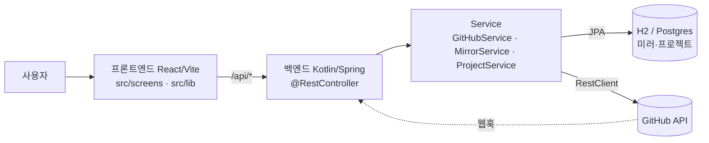
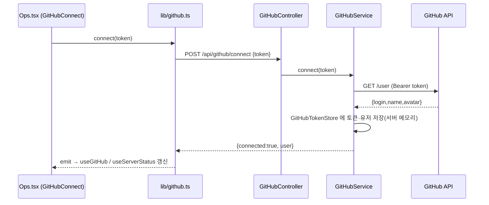
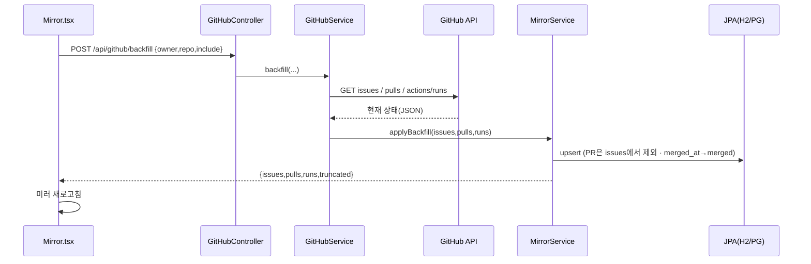
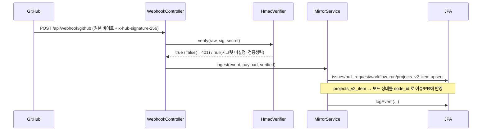

# 아키텍처 — 사용자 요청이 프론트엔드·백엔드에서 어떻게 흐르나

두 조각이 **HTTP/JSON(`/api/*`) 경계**로만 만나요.

- **프론트엔드** (React + Vite, `src/`): 화면·상태. GitHub를 직접 호출하지 않고 **`/api/*` 만** 부름.
- **백엔드** (Kotlin + Spring Boot, `backend/`): GitHub 프록시 · 웹훅 미러 DB(H2/Postgres) · 프로젝트 영속.
- 운영은 **jar 하나가 SPA + `/api` 를 단일 오리진**으로 서빙. 개발은 Vite가 `/api` 를 백엔드로 프록시.

**계층 규칙**: 화면(`src/screens/*`) → 클라이언트(`src/lib/*`) → `@RestController`(`backend/.../web/*`) → `@Service`(`backend/.../service/*`) → JPA 리포지토리(`backend/.../domain/*`) 또는 `RestClient`(→ GitHub).

---

## 1) 앱 부팅 — 시드 하이드레이션
사용자가 앱을 열면:
1. `src/main.tsx` → `src/lib/api.ts#fetchBootstrap()` 가 **`GET /api/bootstrap`** 호출.
2. 백엔드 `BootstrapController` 가 번들된 `static/bootstrap.json`(= `src/data.source.ts` 시드) 반환.
3. `src/data.ts#hydrateData()` 가 받은 값으로 `PROJECTS·PIPELINE_STAGES·HUMAN_TASKS…` 를 **제자리 채움**(라이브 바인딩).
4. 화면은 수정 없이 그 값을 렌더.

## 2) GitHub 연결 (PAT) — 설정 › 연동

→ **상단바**(`Layout.tsx` + `lib/status.ts`)가 "연결됨 · {login}" 으로 바뀜. 토큰은 브라우저에 저장 안 됨(서버 메모리만).

## 3) 미러 조회 (읽기) — GitHub 미러 / Projects 보드
1. 화면 마운트 → `src/lib/mirror.ts` 가 **`GET /api/mirror/{summary,issues,pulls,runs,events,board}`** 병렬 호출.
2. `MirrorController` → `MirrorService.list*()` → **JPA 리포지토리**에서 조회 → DTO로 매핑.
3. 화면이 표·칸반으로 렌더. (`activeRuns` 는 status≠completed 개수 → 상단바 "Actions N".)

## 4) 확장 필드 편집 (stage/priority) — PATCH
1. `Mirror.tsx` 의 `AdminSelect` 변경 → `mirror.setIssueAdmin()` → **`PATCH /api/mirror/issues {repo,number,stage}`**.
2. `MirrorController.patchIssue` → `MirrorService.setIssueAdmin()`: **본문에 있는 키만** 반영(없는 키 보존) → JPA 저장.
3. 이 필드는 **GitHub로 안 나감**(어드민 소유). 다음 재-미러링에도 보존.

## 5) 쓰기 — 이슈 생성 · @claude
1. 모달 → `lib/github.ts#createIssue` / `mentionClaude` → **`POST /api/github/issues`** / **`/api/github/claude`**.
2. `GitHubController` → `GitHubService` 가 **`RestClient` 로 GitHub API에 POST**(Bearer, 서버 토큰). `@claude` 는 프롬프트 앞에 `@claude` 를 붙여 코멘트.
3. 실제 GitHub에 이슈/코멘트 생성 → 링크 반환. (결과는 웹훅이 연결돼 있으면 [8]로 미러에 다시 들어옴.)

## 6) 백필 (초기 동기화) — "지금 동기화"

웹훅은 "앞으로의" 이벤트만 주므로, 연결 직후 **현재 상태**를 이 백필로 한 번 당겨와요.

## 7) 프로젝트 생성 (영속)
1. `Projects.tsx` 마법사 → `lib/projects.ts#createProject(project)` → **`POST /api/mirror/projects`**(id·name 필수).
2. `MirrorController` → `ProjectService.create()` → `ProjectEntity` **JPA 저장(영속)**.
3. 화면은 **서버 프로젝트 + 번들 시드(데모)** 를 합쳐 렌더(서버 우선). 새로고침해도 유지.

## 8) 웹훅 수신 (GitHub → 서버, 프론트 무관)

프론트는 이 흐름에 직접 관여하지 않고, 다음 미러 조회([3])/새로고침 때 반영된 데이터를 봐요.

---

## 개발 vs 운영
- **운영**: `backend/Dockerfile` 이 프론트(dist)+백엔드(jar)를 함께 빌드 → **jar 하나**가 `static/`(SPA) + `/api/*` 를 8443에서 서빙.
- **개발(HMR)**: 백엔드를 8080으로 띄우고, `pnpm dev`(Vite 8443)가 `/api` 를 `BACKEND_URL`(기본 8080)로 **프록시**. 프론트 소스는 Vite HMR.
- **DB**: 로컬 H2(파일) · 운영 Postgres(`SPRING_PROFILES_ACTIVE=prod` + `DATABASE_URL`). PAT는 서버 메모리(재시작 시 소멸).
