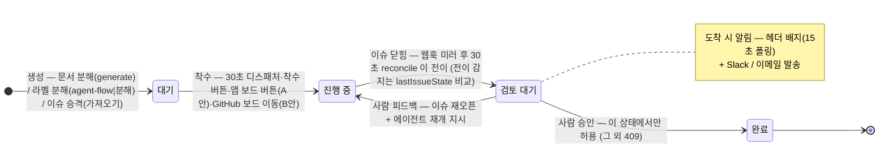
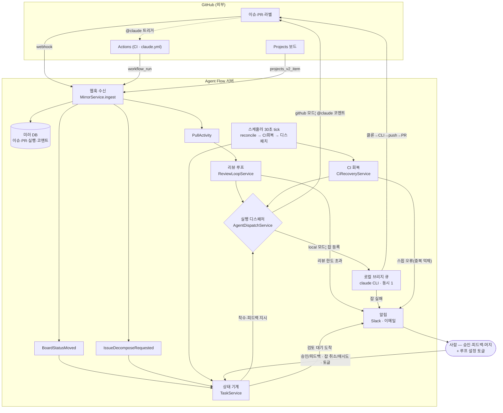
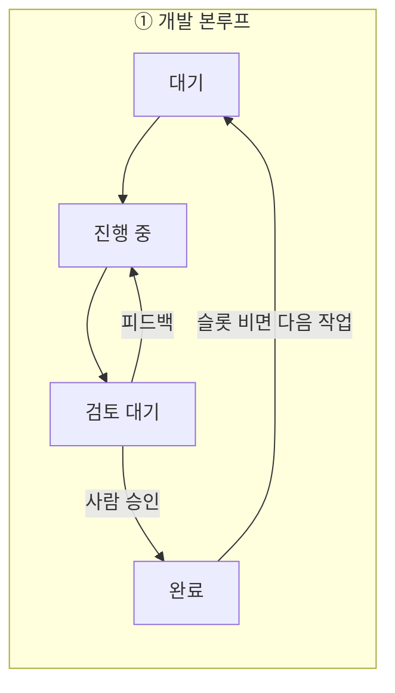
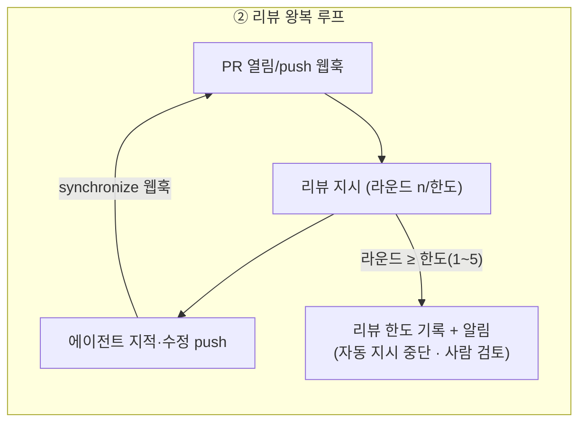
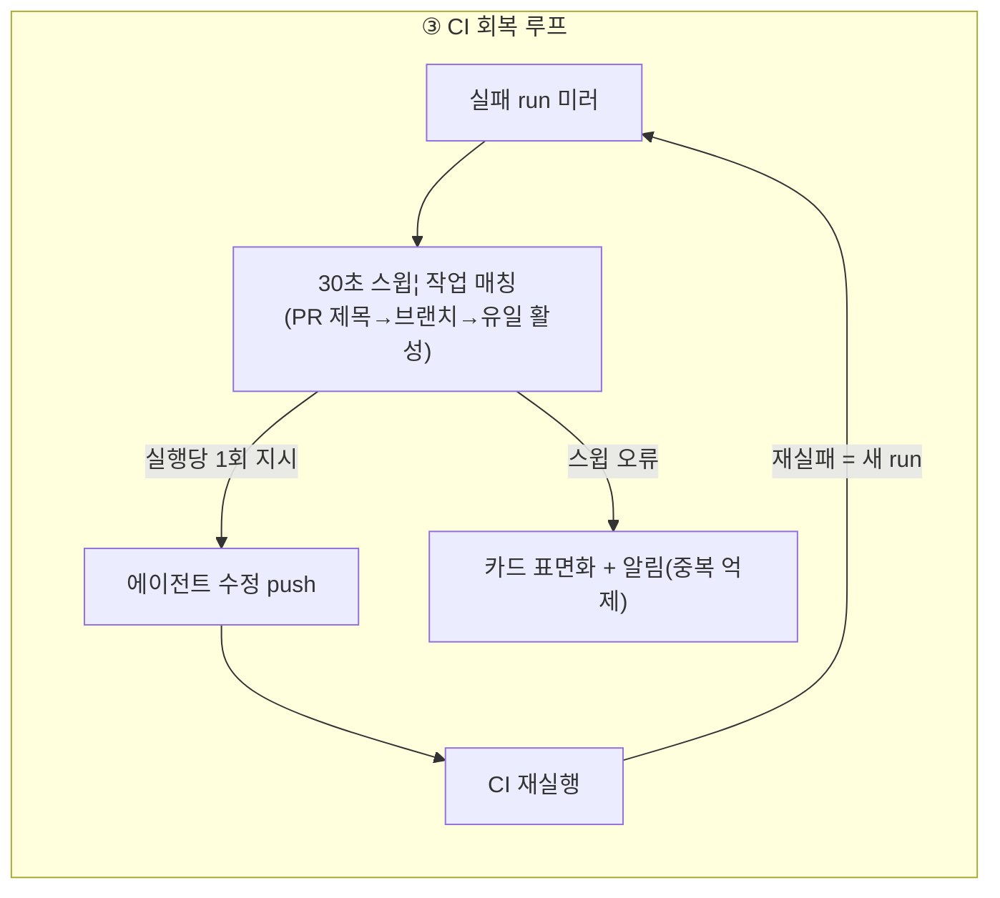
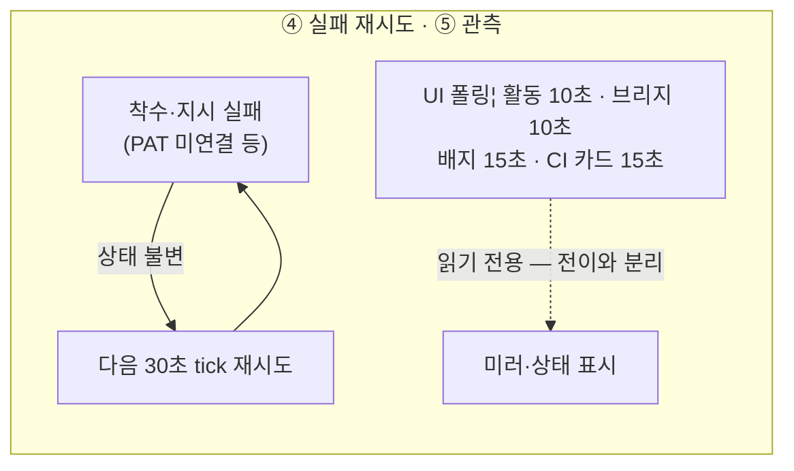

# 자동화 그래프 구조

> Agent Flow 의 루프·그래프 설계 문서. 코드가 바뀌면 이 다이어그램도 함께 갱신하세요.
> (상태 기계: `TaskService` · 이벤트: `MirrorService` · 스케줄러: `DispatchScheduler` ·
> 실행 분기: `AgentDispatchService` — 마지막 검증 2026-08-11, 샌드박스 E2E 통과 기준)

## 1. 작업 상태 그래프 (단일 상태 기계)

노드는 4개, **완료로 들어가는 엣지는 사람 승인 하나뿐**입니다. 상태 값은 화이트리스트로
잠겨 있어(`patch` 검증) 이 그래프 밖의 전이는 불가능해요.

가드 요약: 착수는 `owner==ai && status==대기` + 단계 게이트(앞 단계 완료) + 슬롯(동시 한도)
+ 우선순위(P1→P3, seq) 순. 승인은 `검토 대기` 에서만, 피드백은 `완료` 가 아니면 허용.

## 2. 행위자 그래프 (누가 엣지를 당기나)

리스너들은 내부 이벤트만 구독해요 — 서비스 간 직접 호출이 없어 순환 의존이 없습니다.
실행 방식(Actions ↔ 로컬 브리지)은 디스패처 한 곳에서 갈라지므로 **그래프는 모드와 무관**해요.

## 3. 루프(사이클) 5개

> ⑤가 "읽기 전용"인 것이 중요해요 — 과거엔 상태 전이(reconcile)가 UI 조회의 부수효과였지만,
> 지금은 스케줄러가 돌리므로 화면을 열지 않아도 그래프가 움직입니다.

## 4. 폭주 방지 가드

| 가드 | 위치 | 막는 것 |
|---|---|---|
| 전이 비교 (`lastIssueState`) | reconcile | 같은 이슈 상태로 중복 전이 |
| 실행당 1회 (`recoveryNotified`) | CI 회복 | 같은 실패에 지시 반복 |
| 라운드 한도 + 경계 매칭 `PR #n(?!\d)` | 리뷰 루프 | 무한 리뷰 왕복 · #1/#12 혼동 과대 계산 |
| 단계·슬롯 게이트 | 디스패처 | 순서 붕괴 · 동시 실행 초과 |
| 멱등 라벨 (`agent-flow:분해완료`) | 라벨 분해 | 웹훅 재전송·재부착 재분해 |
| 브랜치·PR 멱등 (`claude/<코드>` 재사용) | 브리지 | 브랜치·PR 난립 |
| 상태 화이트리스트 + 승인 가드 | patch·review | 그래프 밖 전이 · 오클릭 완료 |
| 알림 중복 억제 (동일 메시지 변경 시만) | 알림 | 30초 반복 오류의 알림 폭주 |

## 5. 조절 손잡이 ↔ 그래프 매핑

| 설정 (전부 UI) | 위치 | 조절하는 엣지/루프 |
|---|---|---|
| 자동 디스패치 on/off · 동시 한도 1~5 | 작업 계획 카드 | ① 대기→진행 중 (자동 경로) |
| 보드 이동 자동 착수 on/off | 작업 계획 카드 | ① B안 트리거 엣지 |
| 자동 리뷰 루프 on/off · 라운드 한도 1~5 | 작업 계획 카드 | ② 전체 · 종단 조건 |
| CI 자동 회복 on/off | 작업 계획 카드 | ③ 자동 스윕 (수동 스윕은 항상 가능) |
| 실행 모드 github/local | 설정 | 디스패처 분기 (그래프 불변) |
| Slack 웹훅 · 이메일 주소 | 설정 | 알림 엣지의 목적지 |
| 브리지 잡 취소·재시도 | 설정 | local 실행 경로의 사람 개입 |
